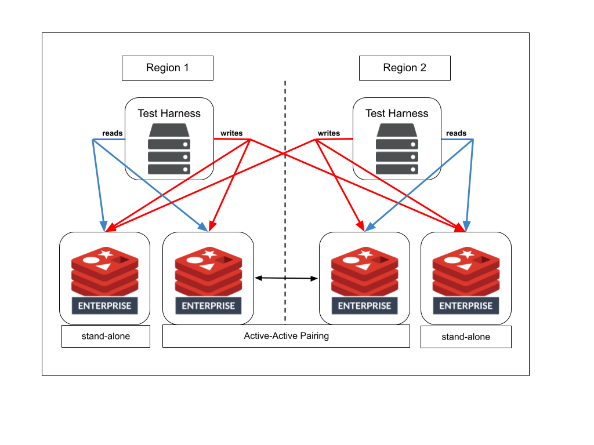

# sorted-sets-aa-vs-sa
Collection of locustfiles and utilities for using locust.io to test Redis

## Overview
This locustfile leverages the locust.io framework to make direct calls to Redis, rather than relying on a REST API server.  This is done to reduce complexity, increase the load that can be generated for a given machine, and to allow recording of response times directly from Redis.

## Execution Modes
The file also has the ability to run in three different Modes: AA, SA, and BOTH.  This modes represent running against an active-active Redis Enterprise database.  All reads and writes will happen to the single database defined in the input parameters.  SA mode is stand-alone.  In this mode, the test harness is responsible for writing data to two sperate stand-alone databases.  This simulates using application code to manage writes to different geographies.  (This setup obviously does not provide the same consistency guarantees as active-active, but may be approriate for some use cases.)  This final mode, BOTH, runs the same transactions agianst active-active Redis and a pair of stand-alone databases.

In all cases, the assumption is that you be running the locust file twice, once in each geography.  Running in the BOTH mode, the architecture looks like the diagram below.

    parser.add_argument("--aa_sa_mode", type=str, env_var="RED_LOCUST_AA_SA_MODE", default="BOTH", help="Test mode [BOTH|SA|SA")
    parser.add_argument("--redis_host", type=str, env_var="RED_LOCUST_HOST", default="localhost", help="Host for Redis")
    parser.add_argument("--redis_port", type=str, env_var="RED_LOCUST_PORT", default="6001", help="Port for Redis")
    parser.add_argument("--username", type=str, env_var="RED_LOCUST_USERNAME", default="", help="Username for Redis")
    parser.add_argument("--password", type=str, env_var="RED_LOCUST_PASSWORD", default="", help="Password for Redis")
    parser.add_argument("--redis_host_sa_local", type=str, env_var="RED_LOCUST_HOST_SA_LOCAL", default="localhost", help="Host for SA Local Redis")
    parser.add_argument("--redis_port_sa_local", type=str, env_var="RED_LOCUST_PORT_SA_LOCAL", default="6002", help="Port for SA Local Redis")
    parser.add_argument("--username_sa_local", type=str, env_var="RED_LOCUST_USERNAME_SA_LOCAL", default="", help="Username for SA Local Redis")
    parser.add_argument("--password_sa_local", type=str, env_var="RED_LOCUST_PASSWORD_SA_LOCAL", default="", help="Password for SA Local Redis")
    parser.add_argument("--redis_host_sa_remote", type=str, env_var="RED_LOCUST_HOST_SA_REMOTE", default="localhost", help="Host for SA Remote Redis")
    parser.add_argument("--redis_port_sa_remote", type=str, env_var="RED_LOCUST_PORT_SA_REMOTE", default="6003", help="Port for SA Remote Redis")
    parser.add_argument("--username_sa_remote", type=str, env_var="RED_LOCUST_USERNAME_SA_REMOTE", default="", help="Username SA Remote for Redis")
    parser.add_argument("--password_sa_remote", type=str, env_var="RED_LOCUST_PASSWORD_SA_REMOTE", default="", help="Password SA Remote for Redis")
    parser.add_argument("--timeout", type=int, env_var="RED_LOCUST_TIMEOUT", default=500, help="Timeout for Redis in ms")
    parser.add_argument("--cluster", type=str, env_var="RED_LOCUST_CLUSTER", default="N", help="Cluster mode (Y/N)")
    parser.add_argument("--tls", type=str, env_var="RED_LOCUST_TLS", default="N", help="TLS (Y/N)")
    parser.add_argument("--key_name_prefix", type=str, env_var="RED_LOCUST_KEY_NAME_PREFIX", default="rloc:", help="Prefix for key names")
    parser.add_argument("--key_name_length", type=int, env_var="RED_LOCUST_KEY_NAME_LENGTH", default=20, help="Length (ie digits) of key name (not including prefix)")
    parser.add_argument("--number_of_keys", type=int, env_var="RED_LOCUST_NUM_OF_KEYS", default=1000000, help="Number of keys")
    parser.add_argument("--value_min_chars", type=int, env_var="RED_LOCUST_VALUE_MIN_BYTES", default=15, help="Minimum characters to store in key value")
    parser.add_argument("--value_max_chars", type=int, env_var="RED_LOCUST_VALUE_MAX_BYTES", default=15, help="Maximum characters to store in key value")
    parser.add_argument("--zipf_shape", type=float, env_var="RED_LOCUST_ZIPF_SHAPE", default=1.01, help="Zipf shape")
    parser.add_argument("--zipf_direction", type=int, env_var="RED_LOCUST_ZIPF_DIRECTION", default=1, help="Zipf direction [1|-1]")
    parser.add_argument("--zipf_max_keys", type=int, env_var="RED_LOCUST_ZIPF_MAX_KEYS", default=10000000, help="Zipf max keys")
    parser.add_argument("--zipf_offset", type=int, env_var="RED_LOCUST_ZIPF_OFFSET", default=0, help="Zipf Offset")
    parser.add_argument("--zrem_seconds", type=int, env_var="RED_LOCUST_ZREM_SECONDS", default=300, help="Seconds to keep when trimming zsets")
    parser.add_argument("--pipeline_size", type=int, env_var="RED_LOCUST_PIPELINE_SIZE", default=100, help="Commands per Redis pipeline")
    parser.add_argument("--zcount_seconds", type=int, env_var="RED_LOCUST_ZCOUNT_SECONDS", default=150, help="Number of seconds to query for zcount")
    parser.add_argument("--jumbo_frequency", type=int, env_var="RED_LOCUST_JUMBO_FREQUENCY", default=50, help="Frequency of jumbo zadd logic")
    parser.add_argument("--jumbo_initial_exclude", type=int, env_var="RED_LOCUST_JUMBO_INITIAL_EXCLUDE", default=100, help="Number of initial keys to exclude from jumbo logic")
    parser.add_argument("--jumbo_size", type=str, env_var="RED_LOCUST_JUMBO_SIZE", default="25,25,50,100,1000", help="Array representing the extra members for jumbo zadds")
    parser.add_argument("--version_display", type=str, env_var="RED_VERSION_DISPLAY", default="0.2", help="Just used to show locust file version in UI")